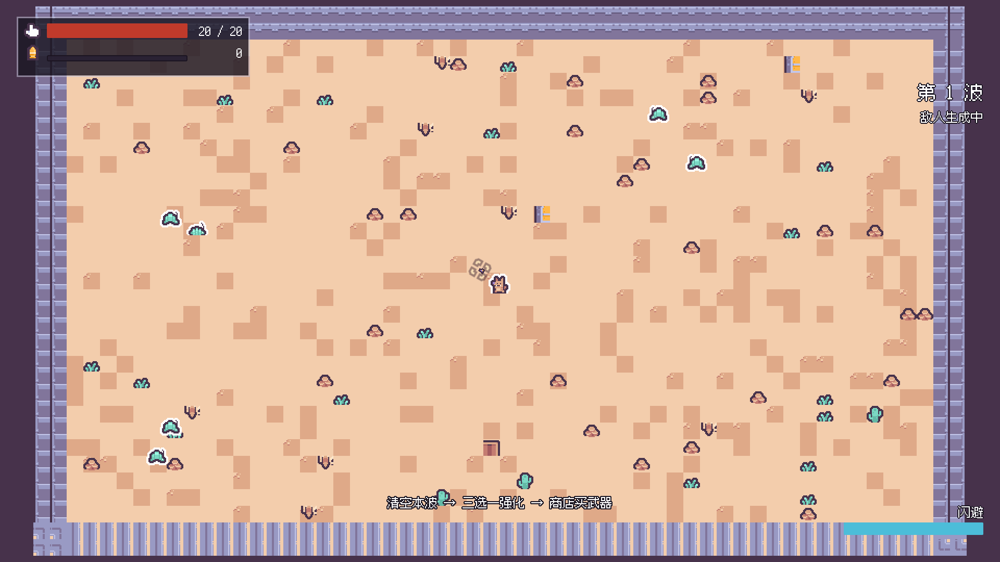
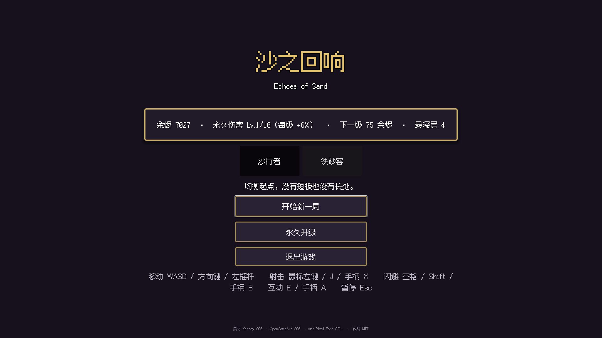
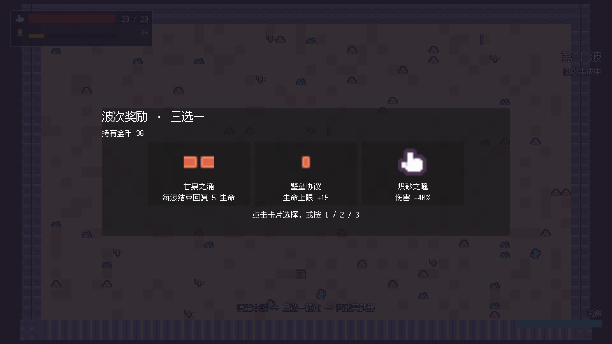
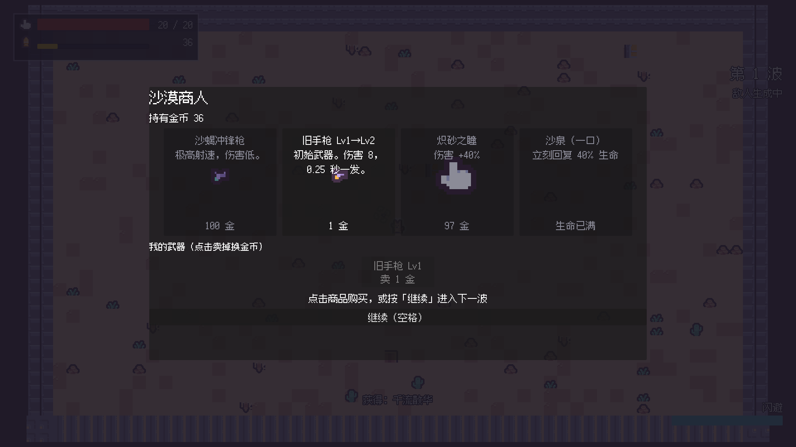
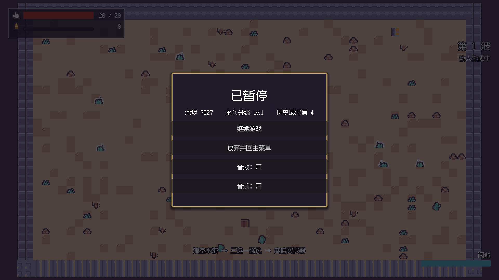
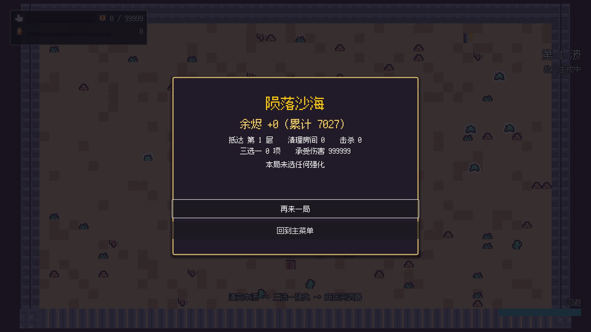
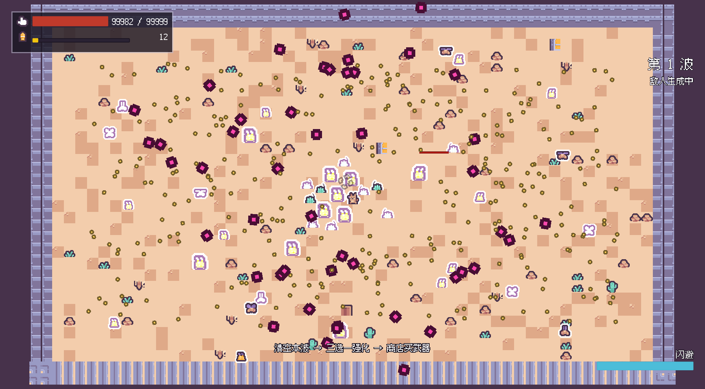

# 沙之回响 · Echoes of Sand

> 沙漠像素风俯视角 2D 弹幕射击 Roguelike · Godot 4.6 · 完全开源（MIT）
> 走位、弹幕、构筑、波次循环 —— 单屏竞技场里的沙丘突围。



## 快速开始

用 **Godot 4.6**（本工程实测 4.6.2.stable.official，现行模板同版本）打开 `sand-echo/` 目录，或命令行：

```bash
# 首次导入素材
godot --headless --path sand-echo --import

# 运行（主场景是主菜单）
godot --path sand-echo
```

按 **开始新一局** 进游戏。

下载现成 exe：见 [GitHub Releases](../../releases)（`sand-echo-windows-x86_64.zip`，单文件约 105 MB）。

## 操作

| 动作 | 键鼠 | 手柄 |
|---|---|---|
| 移动 | W A S D / 方向键 | 左摇杆 |
| 瞄准 | 鼠标位置 | 右摇杆 |
| 射击 | 鼠标左键 / J | X / 右扳机 |
| 闪避 | 空格 / LShift | B / 左扳机 |
| 暂停 | Esc | Start |
| 菜单确认 | Enter | A |

## 玩法

单局是 **Brotato 式波次循环**，不是房间制：

```
第 n 波开打 → 清完所有敌人 → 三选一升级 → 商店买武器/回血 → 第 n+1 波
            └─ 每 10 波是 Boss 波（Boss 不清场，仍出 60% 杂兵）──┘
```

- 单屏竞技场 896×528 px，摄像机 `zoom=2.0`，无过门因此没有切房帧。
- 击杀敌人掉落余烬/金币；死亡或通关后结算，进入主菜单。
- **商店配比恒为 `[武器, 武器, 属性小件, 回复]` 4 位**，tier 按波次解锁（T2 第 2 波 / T3 第 4 波 / T4 第 8 波）。买不起置灰，已持有武器可回收（累计投入 50% 退款）。
- **死亡转余烬**：金币 × 0.5 变「余烬」，主菜单换永久伤害 +6%/级（最高 10 级），存档在 `user://meta.json`。

## 截图

| | |
|---|---|
|  |  |
|  |  |
|  |  |

## 工程结构

```
.（仓库根）
├─ sand-echo/              Godot 工程本体
│  ├─ project.godot        工程配置（主场景 / 自动加载 / 输入映射 / 碰撞层）
│  ├─ autoload/            RunState 单局 / MetaProgress 元进度 / EventBus / Sfx
│  ├─ scenes/              10 个场景，各一职责
│  ├─ scripts/             16 个脚本，一个职责一个脚本
│  ├─ data/                enemies / weapons / upgrades / waves / characters 数值表
│  ├─ assets/              Kenney 素材（CC0）+ 生成好的 TileSet / SpriteFrames / UI 主题
│  ├─ tests/               18 个场景的测试：冒烟 / 审计 / 压测 / 截图回归
│  └─ docs/                设计冻结清单 / 素材映射 / 场景节点树 / 验证证据 / 截图
├─ kenney_desert-shooter-pack_1.0.zip   Kenney 原始包（见下方「素材」）
├─ docs/game-design-document.md         策划案（阶段一产物）
└─ ...
```

## 测试与自检

```bash
# 结构 / 资源引用 / 资源规格 / 可追溯，一次性核对并产出 JSON 报告
python <godot-game-suite>/scripts/check_godot_project.py sand-echo \
  --spec sand-echo/spec.json --freeze sand-echo/docs/design-freeze.json \
  --json ../check-report.json

# 全部测试（需要窗口化，headless 下渲染信号永不触发，会挂到超时）
Godot_v4.6.2-stable_win64_console.exe --path sand-echo --resolution 1920x1080 \
  --import && res://tests/<名字>.tscn
```

当前实测：**18 个测试场景全过**，其中断言类 9 个合计 **272 项断言 / 0 失败**；
脚本编译门禁 39 个脚本全过；结构自检 **0 错误 / 2 警告**（均为有意保留：未引用的
资源 id、预留的 `pause`/`ui_confirm` 输入动作）。

性能（`PLAT-003`，规格上限档 40 单位 + 累计 372 发弹幕）：平均帧时间 **3.46 ms**、
超 16.67ms 预算帧 **0.00%**、物理单核占用 31% → 达标，余量约 4.8 倍。

## 构建与导出

```bash
# 本地导出（需装好对应版本的导出模板）
godot --headless --path sand-echo \
  --export-release "Windows Desktop" "build/windows/sand-echo.exe"
```

仓库**已含 CI**（`.github/workflows/export-windows.yml`）：推送 `v*` 标签即自动导出
Windows 单文件 exe 并挂到 Release。版本锚定在 `sand-echo/.godot-version`。

## 文档

| 文档 | 内容 |
|---|---|
| [`sand-echo/docs/design-freeze.json`](sand-echo/docs/design-freeze.json) | 设计冻结清单（**47 条**，`status: frozen`），代码里用 `@trace <编号>` 引用，覆盖率 47/47 = 100% |
| [`sand-echo/docs/asset-mapping.md`](sand-echo/docs/asset-mapping.md) | Kenney 素材 → 工程资源的逐条映射、调色板、尺寸口径 |
| [`sand-echo/docs/scene-tree.md`](sand-echo/docs/scene-tree.md) | 场景清单、节点树、碰撞层、信号清单、Autoload 取舍 |
| [`sand-echo/docs/verification.md`](sand-echo/docs/verification.md) | 自检结果、全部断言、压测数据、截图证据、待实测项 |
| [`docs/game-design-document.md`](docs/game-design-document.md) | 策划案（阶段一产物） |

## 素材与许可

- 代码：**MIT**（见 [`LICENSE`](sand-echo/LICENSE)）。
- 美术 / 音效：**Kenney Desert Shooter Pack 1.0**（CC0），上游
  [kenney.nl/assets/desert-shooter-pack](https://kenney.nl/assets/desert-shooter-pack)。
  仓库根目录的 `kenney_desert-shooter-pack_1.0.zip` 是**原始包的保留副本**（553 KB），
  已提取得干的素材在 `sand-echo/assets/` 下，逐条映射见 asset-mapping。
- BGM：OpenGameArt 两首 CC0 曲（Desert Theme / Great Boss），来源见 `sand-echo/assets/audio/bgm/LICENSE-bgm.txt`。
- 中文像素字体：**Ark Pixel Font** 12px（OFL-1.1），全文见 `sand-echo/assets/ui/fonts/OFL.txt`。

## 已知缺口 / 待实测

- **整局运行时内存峰值**尚未实测（原 `memory_test` 依赖已删除的房间制 API，删除后未重写）；
  现有字体专项数据有效（9.58 MB 字体净常驻约 5 MB）。
- **手感参数未做真人试玩调优**，当前取值直接照搬策划案。
- **跨分辨率**内存/帧数据未系统取数。
- macOS / Linux / Web 导出未做（只验证了 Windows）。
- `pause` / `ui_confirm` 输入映射为预留，代码未引用（结构自检告警，有意保留）。

## 许可证

MIT，随取随改，欢迎 PR。素材见各自 LICENSE 文件。