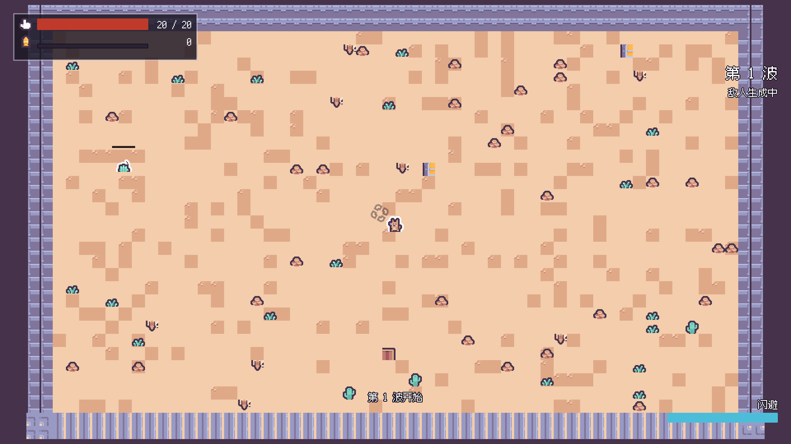

# 沙之回响 · Echoes of Sand

> 沙漠像素风俯视角 2D 弹幕射击 Roguelike · Godot 4.6 · 完全开源（MIT）
> 关键词：走位、弹幕、构筑、开源可改



## 快速开始

1. 用 **Godot 4.6**（本工程实测 4.6.2.stable.official）打开本目录，或命令行：
   ```bash
   godot_console.exe --headless --path . --import     # 首次导入素材
   godot_console.exe --path .                          # 运行（主场景是主菜单）
   ```
2. `开始新一局` 进游戏。**WASD/方向键**移动、**鼠标左键/J**射击、**空格/Shift**闪避、**Esc**暂停。

## 操作

| 动作 | 键鼠 | 手柄 |
|---|---|---|
| 移动 | W A S D / 方向键 | 左摇杆 |
| 瞄准 | 鼠标位置 | 右摇杆（拨动时接管） |
| 射击 | 鼠标左键 / J | X / 右扳机 |
| 闪避 | 空格 / LShift | B / 左扳机 |
| 互动（门口提示） | E | A |
| 暂停 | Esc | Start |
| 菜单确认 | Enter | A |

## 玩法

- **单局 15–25 分钟**：进入楼层 → 逐房间清怪 → 拾遗物/药水 → 打 Boss → 下一层。
- **清场才开门**：房间没清完时门口锁死，按互动键会提示。
- **遗物即 Build**：12 种遗物实时改属性（伤害 / 生命 / 射速 / 移速 / 多重弹 / 散射 / 穿透 / 余烬加成 / 楼层回血）。
- **死亡转余烬**：金币 × 0.5 变成「余烬」，在主菜单换成永久伤害加成（每级 +6%，软上限 10 级，存档在 `user://meta.json`）。

## 工程结构

```
sand-echo/
├─ project.godot          工程配置（主场景 / 自动加载 / 输入映射 / 碰撞层命名 / 像素过滤）
├─ spec.json              自检规格（必需目录、资源清单、冻结门禁）
├─ autoload/              RunState 单局状态 / MetaProgress 元进度 / EventBus 事件 / Sfx 音效
├─ scenes/                13 个场景，每个一句话职责
├─ scripts/               18 个 GDScript，一个脚本一个职责
├─ data/                  enemies.json / relics.json 数值表
├─ assets/                Kenney 素材（CC0）+ 生成好的 TileSet / SpriteFrames / UI 主题
├─ tests/                 headless 冒烟测试 + 固定分辨率截图回归 + 性能压测
└─ docs/                  设计冻结清单 / 素材映射 / 场景节点树 / 验证证据 / 压测报告 / 截图
```

## 文档

| 文档 | 内容 |
|---|---|
| [`docs/design-freeze.json`](docs/design-freeze.json) | 设计冻结清单（38 条，`status: frozen`），工程里用 `@trace <编号>` 引用，覆盖率由脚本统计 |
| [`docs/asset-mapping.md`](docs/asset-mapping.md) | Kenney 素材 → 工程资源的逐条映射、调色板、房间尺寸口径、**已知缺口** |
| [`docs/scene-tree.md`](docs/scene-tree.md) | 场景清单、节点树、碰撞层、信号清单、Autoload 取舍、场景流 |
| [`docs/verification.md`](docs/verification.md) | 自检结果、冒烟测试断言、性能压测数据、截图证据、**待实测项** |
| [`../docs/game-design-document.md`](../docs/game-design-document.md) | 策划案（阶段一产物） |

## 自检与测试

```bash
# 结构 / 资源引用 / 资源规格 / 可追溯 一次性核对，产出 JSON 报告
python <godot-game-suite>/scripts/check_godot_project.py . \
  --spec spec.json --freeze docs/design-freeze.json --json ../check-report.json

# 玩法冒烟测试：地牢连通性、数值公式、房间构建、战斗闭环、死亡结算
godot_console.exe --headless --path . res://tests/smoke_test.tscn   # 退出码 0 = 全通过

# 截图回归：渲染到固定 1920×1080 SubViewport，与窗口大小 / DPI 无关
godot_console.exe --path . res://tests/screenshot.tscn -- --shot-dir="<目录>/"

# 性能压测：必须窗口化，脚本自动关垂直同步并解除帧率上限
#   规格上限档（40 单位 / 300 弹幕）实测 3.21 ms（311 fps），超预算帧 0.00%
Godot_v4.6.2-stable_win64_console.exe --path . --resolution 1920x1080 \
  res://tests/stress_test.tscn -- --units=40 --bullets=300 --frames=900

# 整局内存峰值：主菜单 → 三局各到第 4 层 → 死亡结算 → 回主菜单
Godot_v4.6.2-stable_win64_console.exe --path . --resolution 1920x1080 res://tests/memory_test.tscn
```

性能与内存实测结论见 [`docs/verification.md`](docs/verification.md) 第 5、6 节
（原始报告 `docs/stress-report-specmax.json`、`docs/memory-report.json`，满负载截图 `docs/screenshots/stress-specmax.png`）。

## 素材与许可

- 代码：**MIT**（见 [`LICENSE`](LICENSE)），随取随改，随手提交 PR。
- 美术 / 音效：**Kenney Desert Shooter Pack**（CC0 1.0），原包许可见 `assets/art/LICENSE-kenney.txt`。
- BGM：**OpenGameArt** 两首 CC0 曲（Desert Theme / Great Boss），逐曲来源见 `assets/audio/bgm/LICENSE-bgm.txt`。
- 中文字体：**Ark Pixel Font** 12px（OFL-1.1），许可全文见 `assets/ui/fonts/OFL.txt`。

## 已知缺口

BGM 与中文字体已补齐（上一轮的 `assetSpec` 告警已消失，工程自检 **0 错误 / 0 告警**）。
60fps 实机压测已完成：`PLAT-003` 达标，规格上限档（40 单位 / 355 发全场弹幕）平均帧时间
3.21 ms，是 60fps 预算的 19%，900 帧零超预算。

仍待处理：整局运行时内存峰值取数（现只有满负载战斗态单点值）、导出预设与多平台打包、
手感参数真人试玩调优、跨分辨率内存峰值 —— 逐条登记在 [`docs/verification.md`](docs/verification.md) 第 7 节，不藏着。

内存峰值也已实测：整局三局跑完 OS 驻留峰值 **242.4 MB**（预算 512 MB，余量 2.1×），三局对照无泄漏。
注意该按 OS 数字记账，Godot 内部监视器自报的只有 132.1 MB，差出的约 110 MB 是 GL 上下文与驱动开销。
字体那 9.8 MB 也测清了：净常驻只有 **3.8 MB**，仓库里 84% 的体积是磁盘占用而非内存。

另外记录一条工程侧隐患：约 **100～120 个同屏单位**（规格的 2.5～3 倍）会撞上 Godot 单线程
2D 物理的单核上限，并在 160 单位时触发间歇性引擎崩溃。当前设计不会走到这个量级，
但要加百人级波次前得先解决。